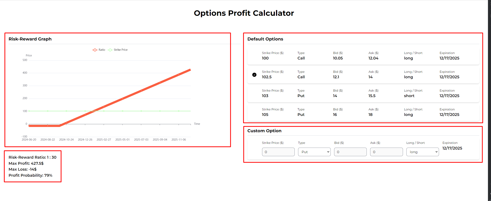

## What I've done
- Installed TailwindCss and HeadlessUI for styling
- Installed Echarts for drawing graph
- User can select one option among four default options
- User can test with custom option



## How I've done

- Used this algorithm to calculate x axes and y axes values to draw chart
```typescript
export const generateChartData = (option: OptionStrategy): ChartData => {
  const { strike_price, type, bid, ask, long_short, expiration_date } = option;

  const priceX: string[] = [];
  const profitLossY: number[] = [];

  const dateRange = getExpiryPriceRange(expiration_date);

  for (let price = 0; price <= dateRange; price++) {
    let profit = 0;

    if (type === OptionStrategyTypeEnum.Call) {
      profit =
        long_short === OptionStrategyLongShortEnum.Long
          ? Math.max(0, price - strike_price) - ask
          : Math.min(0, strike_price - price) + bid;
    } else if (type === OptionStrategyTypeEnum.Put) {
      profit =
        long_short === OptionStrategyLongShortEnum.Long
          ? Math.max(0, strike_price - price) - ask
          : Math.min(0, price - strike_price) + bid;
    }

    priceX.push(moment().add(price, 'day').format('YYYY-MM-DD'));
    profitLossY.push(profit);
  }

  return {
    x: priceX,
    y: profitLossY
  };
};
```

- Used this algorithm to calculate the risk-reward ratio and profit probability
```typescript
export const getRiskRewardRatio = (
  profitLoss: number[]
): {
  ratio: string;
  maxProfit: number;
  maxLoss: number;
} => {
  const maxProfit = Math.max(...profitLoss);
  const maxLoss = Math.min(...profitLoss);

  const ratio = maxProfit / Math.abs(maxLoss);

  return {
    ratio: `1 : ${Math.floor(ratio)}`,
    maxProfit,
    maxLoss
  };
};
```
```typescript
export const getProfitProbability = (profitLoss: number[]): string => {
  const totalScenarios = profitLoss.length;
  const profitableScenarios = profitLoss.filter((profit) => profit > 0).length;

  return ((profitableScenarios / totalScenarios) * 100).toFixed(0);
};
```


## How to run

- Install packages:
```bash
npm install
```
- Run project on localhost:8000
```bash
npm run dev
```
- Testing
```bash
npm run test
```

node version: 16.15.0

